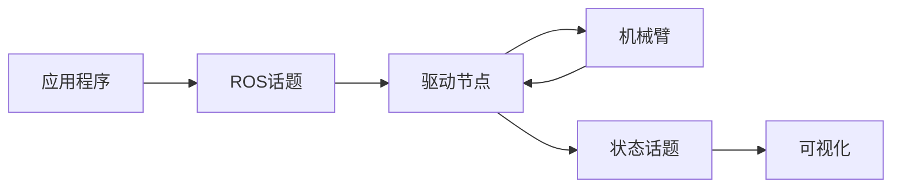

# Horizon ARM ROS2 - 六轴机械臂控制平台

<div align="center">


**完整的六轴机械臂控制平台，集成ROS2、MoveIt2、图形界面控制和硬件驱动**

[快速开始](#-快速开始) • [功能特性](#-功能特性) • [系统架构](#-系统架构) • [文档指南](#-文档指南)

</div>

---

## 🎯 功能特性

### 核心优势
- **🔧 模块化架构**: 清晰的分层设计，易于理解和扩展
- **🎮 多控制模式**: 支持直接控制、话题通信、运动规划
- **🎨 完整可视化**: 集成MoveIt2和RViz的3D仿真环境
- **⚡ 实时控制**: 高频率实时控制和轨迹跟踪
- **🚀 便捷部署**: 标准ROS2工作空间部署

### 功能模块

#### 🖥️ 图形化控制界面
- **直观操作**: Tkinter图形界面，支持实时操作
- **状态监控**: 关节角度、运行状态、安全状态显示
- **参数调节**: 速度、加速度等运动参数实时调整
- **安全保护**: 关节限位、急停、安全断开功能

#### 🤖 ROS2系统集成
- **话题通信**: 标准ROS2话题接口和消息格式
- **服务调用**: 完整的ROS2服务架构
- **运动规划**: MoveIt2路径规划和碰撞检测
- **可视化仿真**: RViz 3D显示和轨迹可视化

#### ⚡ 实时控制系统
- **多频率支持**: 可配置的控制频率
- **轨迹插值**: 梯形速度曲线和样条插值
- **同步控制**: 多轴协调运动算法
- **状态反馈**: 实时位置和速度反馈

## 🚀 快速开始

### 环境要求
```bash
# 系统要求
# - Ubuntu 22.04 LTS
# - ROS2 Humble
# - Python 3.10+

# 安装依赖
sudo apt update
sudo apt install ros-humble-moveit ros-humble-ros2-control
sudo usermod -a -G dialout $USER  # 串口权限
```

### 系统构建
```bash
# 进入工作空间
cd ~/Horizon_ARM_ROS2

# 编译构建
colcon build --symlink-install
source install/setup.bash
```

### 启动系统
```bash
# 一键启动完整平台
ros2 launch horizon_arm_bridge bringup_sdk_ui.launch.py
```

### 运行示例程序
```bash
# 基础关节控制
python3 examples/basic_joint_control.py

# 轨迹跟踪演示
python3 examples/servo_square.py

# 抓取放置演示
python3 examples/pick_and_place_demo.py
```

## 🏗️ 系统架构

### 控制模式

#### 直接控制模式


#### 话题通信模式  


#### 运动规划模式


## 📚 文档指南

| 文档 | 描述 |
|------|------|
| [系统总览](docs/00_项目总览.md) | 平台架构和工作原理 |
| [环境配置](docs/01_环境基线.md) | 开发环境配置指南 |
| [SDK安装](docs/02_SDK安装与验证.md) | 硬件SDK安装方法 |
| [系统构建](docs/03_构建与一键启动.md) | 编译构建和启动指南 |
| [参数配置](docs/04_映射与限位.md) | 机械臂参数配置 |
| [故障排除](docs/05_常见问题.md) | 常见问题和解决方案 |

## 📁 目录结构

```
Horizon_ARM_ROS2/
├── arm-ros2/                    # 核心控制模块
│   ├── review_ui.py             # 图形化控制界面
│   └── mapping.yaml             # 机械臂配置文件
├── src/                         # ROS2功能包
│   ├── horizon_arm_bridge/      # 硬件驱动桥接
│   ├── horizon_arm_moveit_config/ # MoveIt2配置
│   └── new_arm/                 # 机器人模型定义
├── examples/                    # 示例程序
├── docs/                        # 技术文档
└── sdk-wheel/                   # SDK安装包
```

## 🎯 技术特点

### 系统优势
- **模块化设计**: 清晰的分层架构，易于扩展和维护
- **丰富示例**: 从基础到高级的完整应用案例
- **详细文档**: 完整的技术文档和使用指南
- **可视化支持**: 直观的3D仿真和状态显示

### 技术架构
- **ROS2标准**: 完全基于ROS2 Humble的现代架构
- **实时控制**: 支持高频率的实时运动控制
- **智能规划**: 集成MoveIt2的路径规划和避障
- **安全可靠**: 完善的安全保护和错误处理机制

## 🔗 相关资源

### 技术文档
- [ROS2 Humble官方文档](https://docs.ros.org/en/humble/)
- [MoveIt2运动规划](https://moveit.ros.org/)
- [机器人控制理论](https://robotics.org/)

### 开发参考
- **ROS2基础**: 节点、话题、服务、参数系统
- **机械臂运动学**: 正逆运动学、雅可比矩阵
- **路径规划**: MoveIt2规划算法和碰撞检测
- **实时控制**: 轨迹插值和多轴同步控制算法

---

<div align="center">

**完整的六轴机械臂控制解决方案**

Horizon Robotics Platform

</div>
