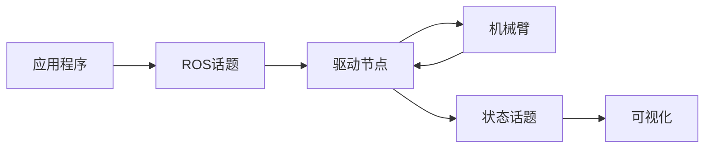

# Horizon ARM ROS2 - 六轴机械臂控制平台

## 项目概述

**Horizon ARM ROS2** 是一个完整的六轴机械臂控制平台，集成了运动规划、可视化仿真和硬件控制功能。系统基于模块化架构，提供从基础控制到高级应用的完整解决方案。

### 系统特性

- **🔧 模块化架构**：清晰的分层设计，便于理解和扩展
- **🎮 多控制模式**：支持图形界面控制、话题通信和轨迹规划
- **🎨 完整可视化**：集成MoveIt2运动规划和RViz可视化
- **⚡ 实时控制**：高频率实时控制和轨迹跟踪
- **🚀 便捷部署**：标准ROS2工作空间部署

### 系统组成

本平台包含三个核心模块：
- **控制界面**：提供直观的图形化操作和硬件连接管理
- **ROS2驱动**：实现话题通信、状态发布和轨迹执行
- **运动规划**：基于MoveIt2的路径规划和碰撞检测

## 系统架构

### 目录结构

```
Horizon_ARM_ROS2/
├── arm-ros2/                        # 核心控制模块
│   ├── review_ui.py                 # 图形化控制界面
│   └── mapping.yaml                 # 机械臂配置文件
├── src/                             # ROS2功能包
│   ├── horizon_arm_bridge/          # 硬件驱动桥接
│   │   ├── scripts/trajectory_stream_sdk_driver.py  # 驱动节点
│   │   └── launch/bringup_sdk_ui.launch.py         # 系统启动文件
│   ├── horizon_arm_moveit_config/   # MoveIt2运动规划配置
│   └── new_arm/                     # 机器人模型定义
├── examples/                        # 示例程序
│   ├── basic_joint_control.py       # 基础关节控制
│   ├── pick_and_place_demo.py       # 抓取放置演示
│   └── servo_square.py              # 轨迹跟踪示例
├── docs/                            # 技术文档
└── sdk-wheel/                       # SDK安装包
```

### 核心组件

- **图形控制界面**：提供直观的机械臂操作和状态监控
- **驱动桥接节点**：处理ROS2话题通信和硬件控制接口
- **运动规划系统**：基于MoveIt2的路径规划和碰撞检测
- **可视化系统**：基于RViz的3D仿真和轨迹显示
- **示例程序**：涵盖基础控制到高级应用的完整案例

## 系统工作原理

### 控制模式

系统提供三种主要的控制模式，适用于不同的应用场景：

#### 直接控制模式

- **应用场景**：单步动作执行、参数调试、系统标定
- **特点**：响应快速、控制精确、操作简单

#### 话题通信模式

- **应用场景**：连续轨迹执行、多节点协作、实时控制
- **特点**：支持多进程、状态同步、扩展性强

#### 规划控制模式

- **应用场景**：路径规划应用、避障演示、复杂轨迹生成
- **特点**：智能规划、碰撞检测、可视化强

### 核心话题

| 话题名称 | 类型 | 功能 |
|---------|------|------|
| `/horizon_arm/servo_target` | Float64MultiArray | 关节目标位置 |
| `/joint_states` | JointState | 关节状态反馈 |
| `/display_planned_path` | DisplayTrajectory | 规划轨迹显示 |

## 快速开始

### 系统启动
```bash
# 一键启动完整系统
ros2 launch horizon_arm_bridge bringup_sdk_ui.launch.py
```

### 示例运行
```bash
# 基础关节控制
python3 examples/basic_joint_control.py

# 轨迹跟踪演示
python3 examples/servo_square.py

# 抓取放置演示
python3 examples/pick_and_place_demo.py
```
